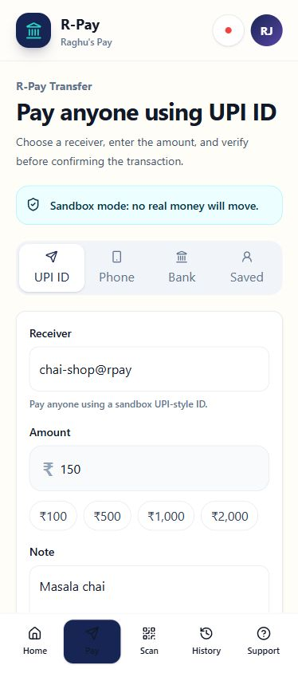
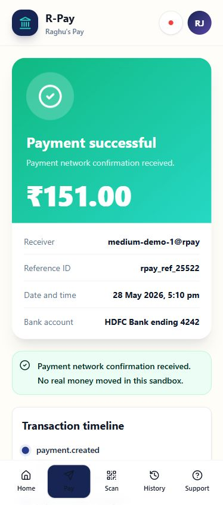
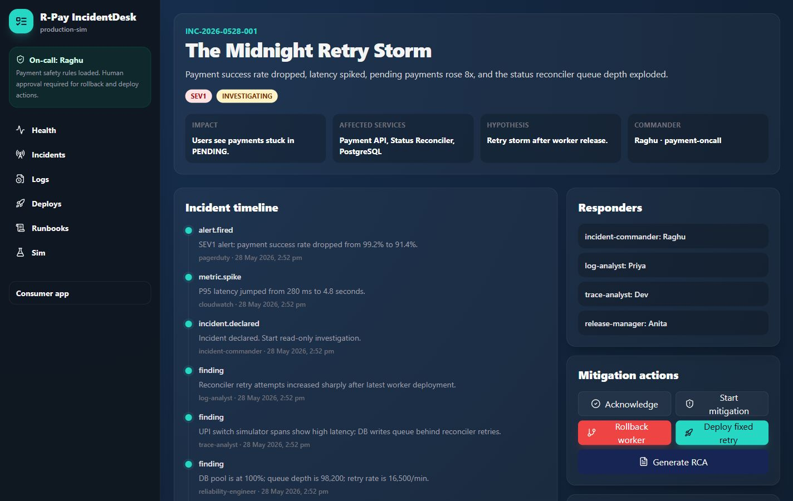
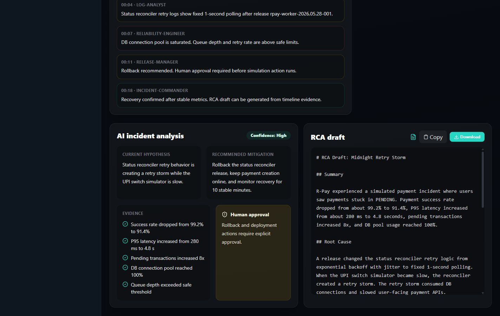

# R-Pay


R-Pay, also called Raghu's Pay, is a fictional UPI-style payment product for India. It is a production-style full-stack demo for learning payment safety, state machines, incident response, observability, RCA workflows, and Claude Code agent collaboration.

R-Pay is not a real payment system. It does not connect to real UPI rails, NPCI, banks, PSPs, PhonePe, Google Pay, payment gateways, or real money movement. The app uses a local sandbox payment network simulator only.

## Screenshots

### Consumer Payment App

| Home | Pay | Status | Transactions |
| --- | --- | --- | --- |
|  |  |  |  |

### IncidentDesk

| Health | Incident | Logs | Deployments |
| --- | --- | --- | --- |
|  |  |  |  |

| Runbooks | RCA |
| --- | --- |
|  |  |

## What You Can Demo

- Mobile-first consumer app with home dashboard, masked account summary, send money, QR scan simulation, confirmation, payment status, history, transaction details, and support.
- Internal IncidentDesk with health metrics, active incidents, timelines, deployment history, logs, traces, runbooks, simulation actions, recovery, and RCA generation.
- The Midnight Retry Storm incident, where a bad status reconciler release creates unsafe fixed-interval retries while the UPI Switch Simulator is slow.

## Architecture

```text
apps/web          Next.js consumer app and IncidentDesk
apps/api          Express API, Prisma, payment APIs, simulator APIs, ops APIs
apps/worker       Status reconciler and incident signal worker
packages/shared   Types, validation, payment state machine, retry and RCA helpers
packages/ui       Shared React UI package placeholder
prisma            PostgreSQL schema and seed data
scripts           Demo traffic, incident, and reset scripts
screenshots       Final GitHub and article-ready screenshots
```

## Local Setup

```bash
docker compose up -d
cp .env.example .env
pnpm install
pnpm db:migrate
pnpm seed
pnpm dev
```

On Windows PowerShell:

```powershell
Copy-Item .env.example .env
```

If `pnpm` is not on your PATH, enable it with Corepack or run commands through `npx pnpm@10.11.0`.

Open:

- Consumer app: http://localhost:3001
- IncidentDesk: http://localhost:3001/ops
- API health: http://localhost:4000/health

Demo user:

- Name: Raghu
- UPI-style ID: `raghu@rpay`
- Account: `HDFC Bank **** 4242`

## Useful Commands

```bash
pnpm test
pnpm lint
pnpm typecheck
pnpm seed
pnpm simulate:incident
pnpm reset:demo
```

DB-backed API integration tests are available after Postgres is running:

```bash
RUN_DB_TESTS=true pnpm --filter @rpay/api test
```

## Make a Payment

1. Open http://localhost:3001.
2. Select **Pay**.
3. Use a sandbox UPI-style payee like `chai-shop@rpay`.
4. Enter an amount and note.
5. Confirm the payment.
6. Open the status page and transaction history.

The simulator can return `SUCCESS`, `FAILED`, or `PENDING`. A payment can only become `SUCCESS` when the local simulator returns a valid confirmation.

## Trigger the Midnight Retry Storm

From IncidentDesk:

1. Open http://localhost:3001/ops/simulations.
2. Trigger **Midnight Retry Storm**.
3. Watch success rate drop, latency spike, pending transactions rise, queue depth explode, and DB pool usage hit 100%.
4. Open the incident timeline, logs, deployment history, and runbook.
5. Use the approval-gated rollback or fixed-retry action.
6. Generate the RCA draft.

From the command line:

```bash
pnpm simulate:incident
```

## Safety Boundary

This repository must stay sandbox-only.

- No real UPI APIs.
- No NPCI, bank, PSP, PhonePe, Google Pay, Paytm, BHIM, or payment gateway APIs.
- No real money movement.
- No copied payment app UI, branding, colors, logos, layouts, screenshots, or assets.
- No committed secrets.
- No autonomous production payment-state correction.

Payment state changes are validated by a shared state machine and written to audit logs.

## Docs

- [Architecture](docs/architecture/ARCHITECTURE.md)
- [Product spec](docs/architecture/SPEC.md)
- [API design](docs/architecture/API_DESIGN.md)
- [Data model](docs/architecture/DATA_MODEL.md)
- [Payment state machine](docs/architecture/PAYMENT_STATE_MACHINE.md)
- [Observability plan](docs/architecture/OBSERVABILITY_PLAN.md)
- [Payment incident runbook](docs/runbooks/payment-incident-runbook.md)
- [Screenshot guide](docs/SCREENSHOTS.md)

The Medium article drafts are intentionally not part of the GitHub-ready copy. The final article series should be written from this working codebase and the Midnight Retry Storm simulation.
