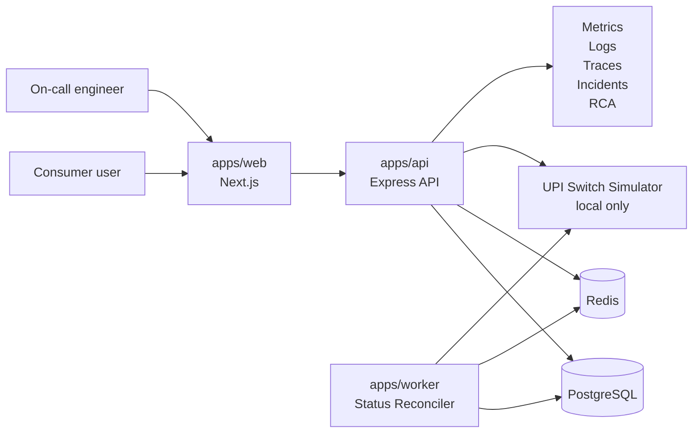

# R-Pay Architecture

R-Pay is a TypeScript monorepo with a Next.js frontend, Express API, worker service, PostgreSQL, Redis, Prisma, and local simulation scripts.

## Runtime Parts

- `apps/web`: Next.js consumer app and IncidentDesk.
- `apps/api`: Express API with Prisma, payment routes, simulator routes, ops routes, and simulation endpoints.
- `apps/worker`: status reconciler and incident signal worker.
- `packages/shared`: payment state machine, schemas, retry policy, RCA helpers, and shared types.
- `packages/ui`: shared React UI package placeholder.
- `prisma`: PostgreSQL schema, migration, and seed data.
- `scripts`: normal traffic, incident, and reset scripts.

## UI Surfaces

Consumer app:

IncidentDesk:

## Simulation Modes

The worker and simulator support healthy, buggy, and fixed behavior through environment/config flags:

- Healthy: exponential backoff, jitter, retry budget, and safe pending state.
- Buggy: fixed 1-second polling, no jitter, no retry budget, no circuit breaker.
- Fixed: restored backoff, jitter, retry budget, and circuit breaker.

The Midnight Retry Storm uses the buggy behavior to create realistic metrics, logs, traces, deployment evidence, timeline entries, AI incident analysis, and RCA drafts.

## Deployment Shape

The local demo maps cleanly to an AWS-style production design:

- `apps/web` as a web frontend.
- `apps/api` on ECS/Fargate or EKS.
- `apps/worker` as a separate worker service.
- PostgreSQL as RDS.
- Redis as ElastiCache.
- Queue/retry behavior backed by Redis or an SQS-like service.
- Metrics, logs, and traces represented with CloudWatch/OpenTelemetry-style data.

