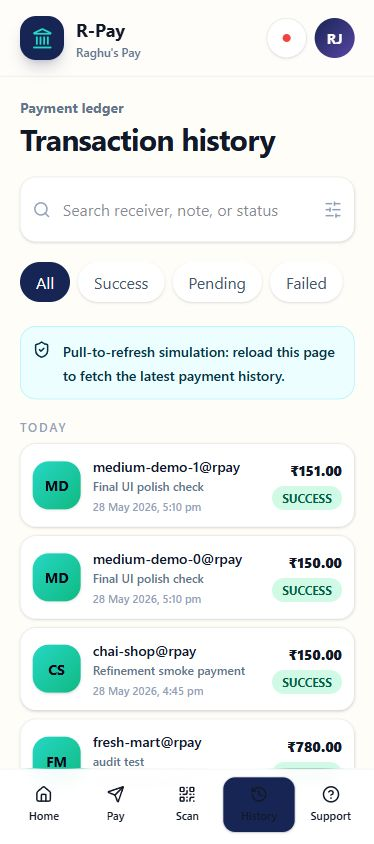

# Data Model

R-Pay uses Prisma with PostgreSQL. The schema is intentionally compact but includes the records needed for payments, auditability, incident response, and RCA generation.

## Core Tables

| Table | Purpose |
| --- | --- |
| `User` | Demo user and UPI-style ID |
| `BankAccount` | Masked account summary |
| `Payment` | Payment lifecycle, status, idempotency key, and reference |
| `PaymentAttempt` | Simulator attempts, latency, and responses |
| `AuditLog` | Append-only payment and operational audit events |
| `MetricSnapshot` | Time-series style payment health snapshots |
| `Incident` | Active, recovering, and resolved incidents |
| `IncidentTimelineEvent` | Incident command timeline |
| `Deployment` | Release history and rollback correlation |
| `OpsLog` | Operational log evidence |
| `TraceSpan` | Trace-style evidence for API and worker activity |
| `Runbook` | Runbook content shown in IncidentDesk |
| `RcaDraft` | Generated RCA draft from local evidence |

## Payment Identity

Payments use `userId` plus `idempotencyKey` as a uniqueness boundary. This prevents duplicate transaction creation when a client retries the same payment request.

## Auditability

Audit logs are append-only. Payment creation, payment state changes, incident events, and recovery-style actions should leave evidence rather than deleting or rewriting history.

## Screenshot

