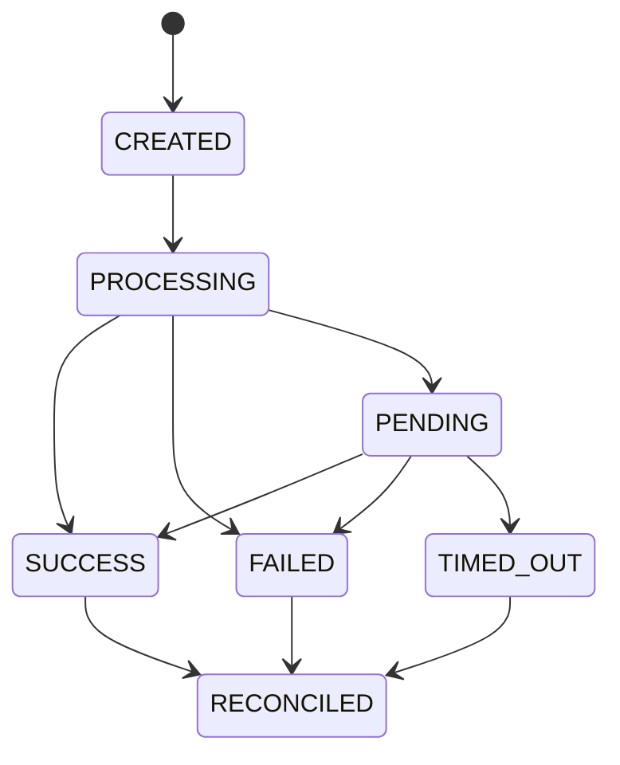

# Payment State Machine

Payment code is high-risk, even in a sandbox. R-Pay keeps payment status changes behind a shared state machine in `packages/shared`.

## States

- `CREATED`
- `PROCESSING`
- `SUCCESS`
- `FAILED`
- `PENDING`
- `TIMED_OUT`
- `RECONCILED`

## Rules

- `POST /api/payments` starts a payment with an idempotency key.
- Duplicate idempotency keys must return the existing payment.
- Invalid transitions are rejected by `packages/shared`.
- `SUCCESS` requires payment network simulator confirmation.
- `PENDING` payments can be reconciled later.
- Audit logs are written for creation and state changes.

## Screenshot

