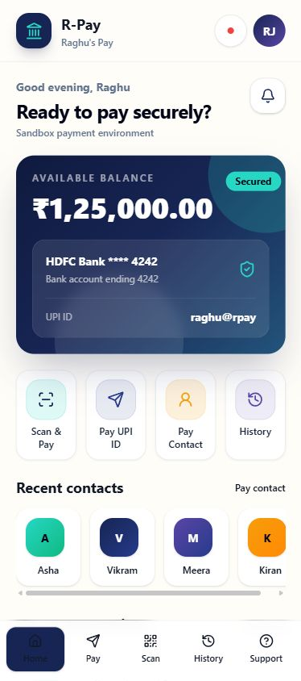
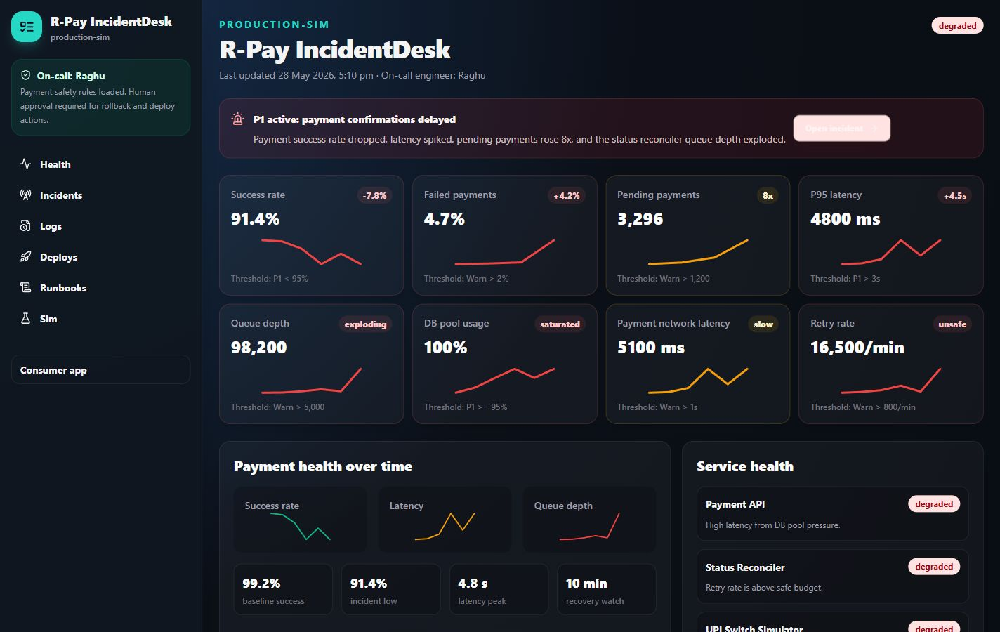

# R-Pay Product Spec

R-Pay, also called Raghu's Pay, is a fictional UPI-style payment app for India. It is built as a sandbox product for learning production payment engineering and incident response.

R-Pay is not a real UPI integration. It never uses real UPI, NPCI, bank, PSP, PhonePe, Google Pay, Paytm, BHIM, or payment gateway APIs.

## Consumer App

The consumer app is mobile-first and optimized for a 390x844 screenshot viewport.

Core flows:

- Home dashboard with greeting, masked bank account, UPI-style ID, quick actions, contacts, merchants, and transactions.
- Send money to a sandbox UPI-style ID.
- QR scan simulation with sample merchant checkout.
- Confirmation screen with receiver, amount, account, and sandbox authorization step.
- Payment status screens for `SUCCESS`, `FAILED`, `PENDING`, `TIMED_OUT`, and `RECONCILED`.
- Transaction history and receipt-style transaction detail.
- Support page for stuck, pending, failed, duplicate, or wrong-receiver payment issues.

## IncidentDesk

IncidentDesk is an internal dark-mode operations dashboard for engineering and SRE workflows.

Core flows:

- Live payment health dashboard.
- Active incident banner and incident detail page.
- Incident timeline, evidence cards, war-room transcript, decisions, and responders.
- Logs and traces with filters.
- Deployment history with suspicious release highlighting.
- Runbook viewer.
- Simulation controls for incident, rollback, fixed retry behavior, and RCA generation.
- AI incident analysis generated from local templates and simulated evidence.

## Incident Story

The main production-style scenario is **The Midnight Retry Storm**.

Symptoms:

- Success rate drops from about 99.2% to 91.4%.
- P95 latency rises from about 280 ms to 4.8 seconds.
- Pending payments increase 8x.
- DB connection pool reaches 100%.
- Reconciler queue depth explodes.
- Users see payments stuck in `PENDING`.

Root cause:

A bad status reconciler release changed retry behavior from exponential backoff with jitter to fixed 1-second polling. When the UPI Switch Simulator became slow, the worker created a retry storm and overloaded shared resources.

## Safety Requirements

- Every payment request must include an idempotency key.
- Duplicate idempotency keys must not create duplicate transactions.
- Payment state transitions must be validated by the shared state machine.
- `SUCCESS` requires simulator confirmation.
- Audit logs must be append-only.
- Rollback and deployment-style actions require explicit human approval in the UI.

