# Diagrams for the R-Pay Article Series

These diagrams are duplicated or expanded from the three articles so they can be reused in Medium, slides, or social posts.

## Part 1: R-Pay High-Level Architecture

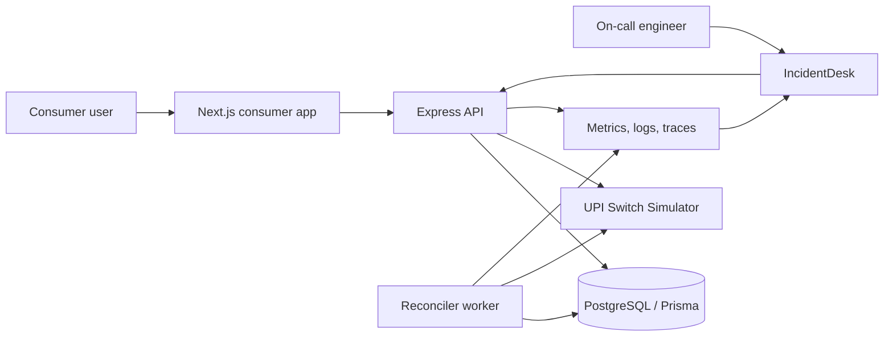

## Part 1: Claude Code Build Workflow

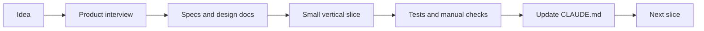

## Part 1: Payment State Machine

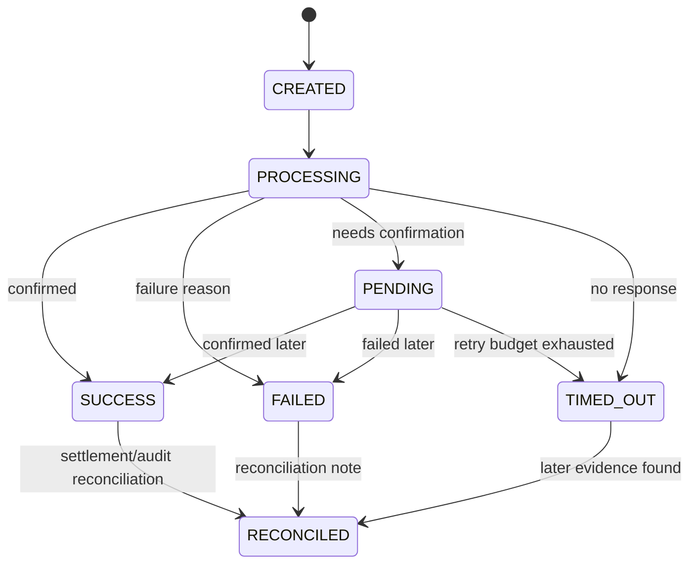

## Part 1: Consumer Payment Flow

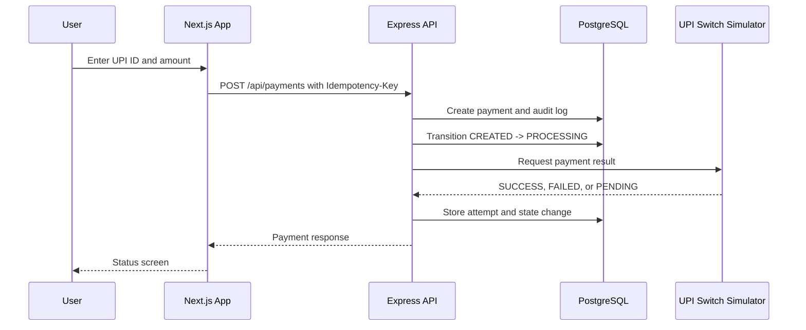

## Part 2: Claude Memory and Extension Hierarchy

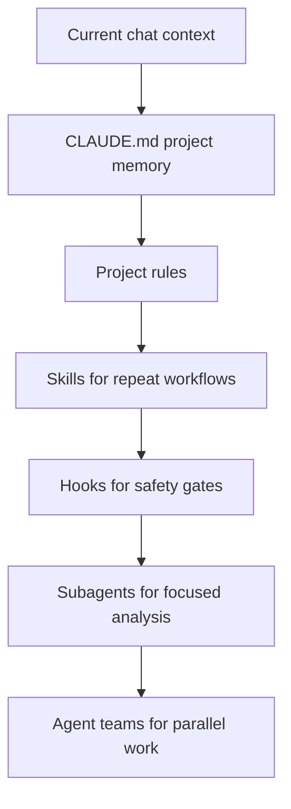

## Part 2: Hooks as Safety Gates

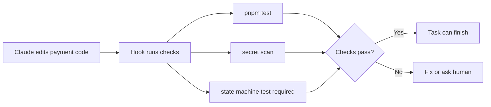

## Part 2: IncidentDesk Observability Pipeline

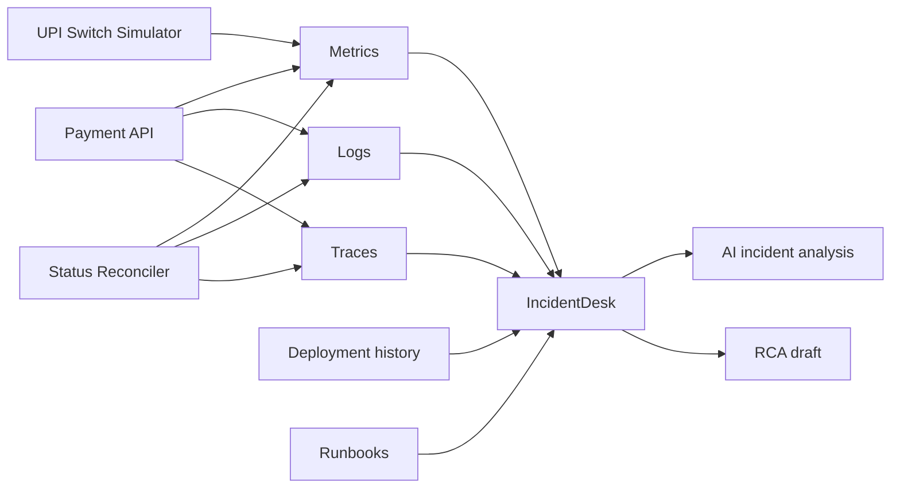

## Part 2: Subagents Around R-Pay

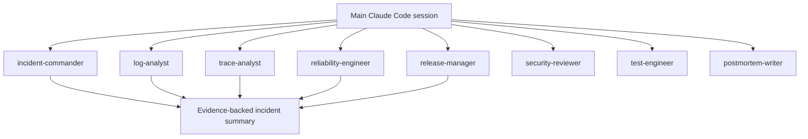

## Part 3: Retry Storm Failure Loop

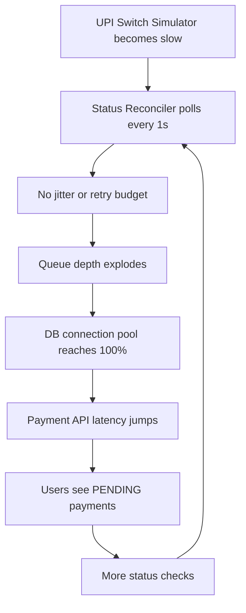

## Part 3: Incident Investigation Flow

```mermaid
flowchart LR
  Alert["P1 alert"] --> Scope["Confirm impact"]
  Scope --> Metrics["Inspect metrics"]
  Metrics --> Logs["Inspect logs"]
  Logs --> Traces["Inspect traces"]
  Traces --> Deploy["Check deployments"]
  Deploy --> Code["Read retry code"]
  Code --> Hypothesis["Root-cause hypothesis"]
  Hypothesis --> Mitigation["Mitigation options"]
  Mitigation --> Approval["Human approval"]
  Approval --> Recovery["Recover and monitor"]
```

## Part 3: Rollback vs Hotfix Decision Tree

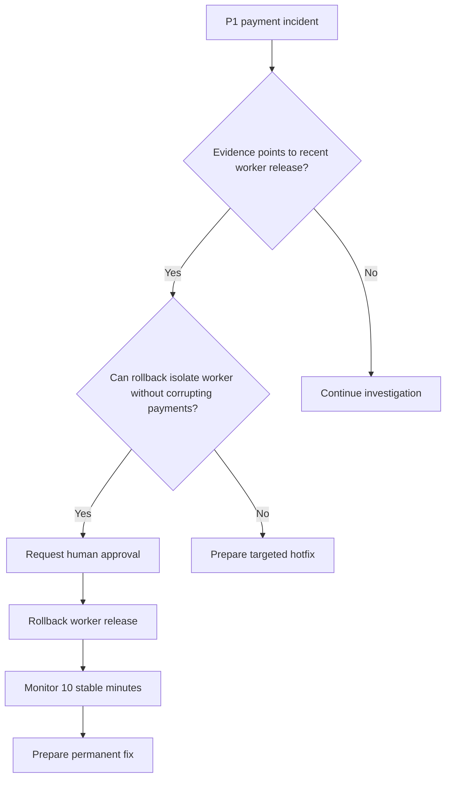

## Part 3: Recovery and RCA Workflow

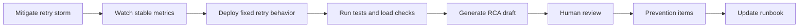
