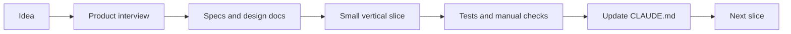
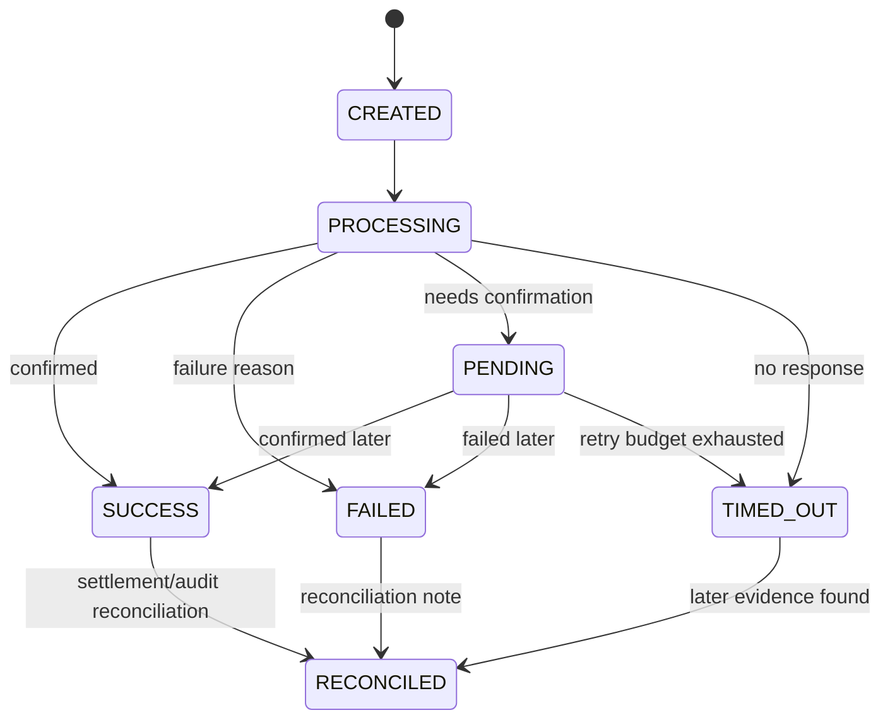
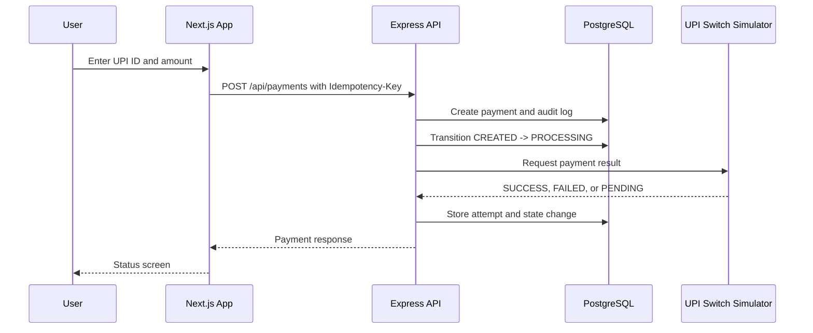

# Building R-Pay: A UPI-Style Payment App with Claude Code Agents

SEO-friendly title: Building a UPI-Style Payment App with Claude Code Agents: R-Pay Case Study

Medium-friendly title: Building R-Pay: A UPI-Style Payment App with Claude Code Agents

Subtitle: How we used Claude Code like a senior engineering partner to design, build, and verify a payment sandbox without pretending payment systems are simple.

Estimated reading time: 13 minutes

## Opening Hook

The most dangerous prompt in software is:

```text
Build me a payment app.
```

It sounds productive. It is also how you get a beautiful demo with missing idempotency, no audit trail, unclear payment states, and a "success" screen that lies to the user.

So for R-Pay, we did something different.

We did not ask Claude Code to magically build everything in one shot. We asked it to slow down, interview us, write the boring-but-important docs, design the state machine, implement one vertical slice, and prove it worked.

That is the difference between using Claude as a chatbot and using Claude Code as an agentic coding partner.

## First, the Safety Boundary

R-Pay, also called Raghu's Pay, is fictional.

It is a sandbox payment product inspired by common Indian UPI payment app patterns. It does not connect to real UPI rails, NPCI systems, banks, PSPs, payment gateways, or real money movement.

Under the hood, the external payment network is a mock service because this is a learning system. In product-facing language, we call it the UPI Switch Simulator or payment network simulator.

That boundary matters. Payment code is high-risk even when the money is imaginary.

## What We Built

R-Pay has two major surfaces, but Part 1 focuses on the consumer app and the first payment slice.


Caption: R-Pay consumer home screen: a sandbox UPI-style payment app with balance, UPI ID, quick actions, contacts, and recent transactions.

Why this image appears here: it shows that the example is not just a backend endpoint. Claude had to reason about a real product flow.

The implemented consumer app includes:

- A mobile-first home screen
- Balance and masked bank account summary
- UPI ID display: `raghu@rpay`
- Payment form for UPI ID flow
- QR scan simulation
- Payment status screen
- Transaction history and receipt-style details
- Support page for reporting payment issues

The backend includes:

- Express API
- Prisma data model
- PostgreSQL
- Worker service
- UPI Switch Simulator
- Payment state machine in `packages/shared`
- Idempotency handling
- Audit logs
- Simulated metrics, logs, traces, incidents, deployments, runbooks, and RCA drafts

This is a sandbox, but it is not a throwaway toy.

## What We Did Not Build

We did not build:

- A real UPI integration
- Bank account linking
- Real KYC
- Real settlement
- Real NPCI connectivity
- Real PSP or payment gateway calls
- Real money movement

This restraint is a feature. It lets us practice the engineering shape of payment systems without crossing legal, financial, or safety boundaries.

## The Claude Code Workflow

The useful loop was simple:



Claude Code is strongest when it can gather context, take action, and verify results. In this repo, that meant reading files, editing TypeScript, running tests, and respecting the rules in `CLAUDE.md`.

The key move was not "write code faster."

The key move was "make the repo teach Claude how to behave."

## Step 1: Ask Claude to Interview You

The first prompt should not be an implementation prompt.

It should make Claude ask questions.

### Copy-Paste Prompt: Product Interview

```text
You are helping me build R-Pay, a fictional UPI-style payment sandbox for India.

Before writing code, interview me like a senior product engineer.

Ask practical questions about:
- user flows
- payment states
- idempotency
- UPI Switch Simulator behavior
- transaction history
- audit logs
- support flows
- observability
- incident simulation
- tests

Safety boundary:
- no real UPI APIs
- no bank APIs
- no real money movement
- use only a local payment network simulator

After the interview, summarize the MVP scope and risks.
```

This prompt does two things.

It tells Claude the domain is payment-like, which raises the safety bar. It also prevents the classic "giant implementation first, requirements later" mistake.

## Step 2: Generate Useful Docs, Not Museum Docs

The repo has architecture docs that support the code:

- `docs/architecture/SPEC.md`
- `docs/architecture/ARCHITECTURE.md`
- `docs/architecture/DATA_MODEL.md`
- `docs/architecture/API_DESIGN.md`
- `docs/architecture/PAYMENT_STATE_MACHINE.md`
- `docs/architecture/OBSERVABILITY_PLAN.md`
- `docs/runbooks/payment-incident-runbook.md`

The older brief also asked for `TEST_PLAN.md` and `TASKS.md`. In the current implementation, those are not separate committed files. The tests exist directly in Vitest files, and tasks were handled through implementation steps.

For a real team, I would still ask Claude to create `TEST_PLAN.md` and `TASKS.md` before a longer build.

### Copy-Paste Prompt: Design Docs

```text
Read the current repo and create concise engineering docs for R-Pay.

Create or update:
- SPEC.md
- ARCHITECTURE.md
- DATA_MODEL.md
- API_DESIGN.md
- PAYMENT_STATE_MACHINE.md
- OBSERVABILITY_PLAN.md
- TEST_PLAN.md
- TASKS.md

Keep the docs practical. Do not over-document.

Important:
- R-Pay is fictional and sandbox-only.
- Use UPI Switch Simulator for the payment network.
- Do not connect to real UPI, bank, PSP, or payment gateway APIs.
- Payment code is high-risk.
- Include idempotency, audit logs, state transitions, and tests.
```

Good docs are not a ceremony. They are memory for humans and Claude.

## Step 3: Design the State Machine Before the Screen

The payment status screen looks simple.


Caption: R-Pay payment status screen: user-facing status depends on validated state transitions and payment network confirmation.

Why this image appears here: payment state is a user experience. It is not just a backend enum.

The current state machine supports:

- `CREATED`
- `PROCESSING`
- `SUCCESS`
- `FAILED`
- `PENDING`
- `TIMED_OUT`
- `RECONCILED`

Here is the shape:



The important rule is blunt:

> R-Pay must not mark a payment `SUCCESS` unless the payment network simulator confirms it.

In the codebase, the shared state machine lives in `packages/shared/src/state-machine.ts`, and API/worker code enforces the confirmation rule.

### Copy-Paste Prompt: Payment State Machine Review

```text
Review the R-Pay payment state machine.

Check:
- every allowed transition
- every rejected transition
- whether SUCCESS requires payment network confirmation
- whether PENDING can be reconciled safely
- whether FAILED and TIMED_OUT preserve audit history
- whether tests cover invalid transitions

Do not change behavior yet.
Return findings first, then suggest small patches.
```

## Step 4: Build One Vertical Slice

The first useful R-Pay slice was:

1. User enters receiver and amount.
2. Web app sends `POST /api/payments`.
3. API requires an `Idempotency-Key`.
4. API creates a payment in `CREATED`.
5. API transitions to `PROCESSING`.
6. API calls the UPI Switch Simulator.
7. API records a payment attempt.
8. API transitions to `SUCCESS`, `FAILED`, or `PENDING`.
9. User sees status.
10. Transaction history shows the result.


Caption: R-Pay payment screen: the first useful slice starts with receiver, amount, note, account, and confirmation.

Why this image appears here: this is the UI half of the vertical slice. It forced the API and state machine to become real.

The route names in the API include internal simulator routes such as `/api/mock-upi/pay`. That name is intentionally internal. The product UI says UPI Switch Simulator or payment network simulator.

## Payment Flow Diagram



### Copy-Paste Prompt: First Vertical Slice

```text
Implement the first R-Pay payment vertical slice.

Scope:
- POST /api/payments
- required Idempotency-Key header
- create payment in CREATED
- transition to PROCESSING
- call the local UPI Switch Simulator
- store payment attempt
- transition to SUCCESS, FAILED, or PENDING
- write audit logs for creation and state changes
- GET /api/payments/:id
- GET /api/transactions
- simple UI flow for pay, status, and transaction history

Safety:
- no real UPI, bank, PSP, or payment gateway APIs
- do not mark SUCCESS without simulator confirmation
- do not skip audit logs

After implementation, run tests and report what passed.
```

## Why Idempotency Is Not Optional

Payment buttons get tapped twice. Mobile networks retry. Browsers resend. API clients time out and try again.

If a duplicate request creates a duplicate payment, your system is not "eventually consistent." It is wrong.

R-Pay requires an idempotency key for every payment. If the same user sends the same key twice, the API returns the existing payment instead of creating a new transaction.

| Problem | Without idempotency | With idempotency |
| --- | --- | --- |
| User taps Pay twice | Two payment records | One payment, one replay |
| Network timeout | Client may create another payment | Client safely retries |
| Support investigation | Ambiguous duplicates | One stable reference |
| Audit | Hard to explain | Clear request history |

In R-Pay, idempotency is stored with the payment record. A duplicate key returns the original payment and records an idempotent replay event.

## Audit Logs Are Product Features

Audit logs sound internal until a user opens support and says:

> My payment is stuck. What happened?

The transaction detail page needs an answer.


Caption: R-Pay transaction history: every payment needs a durable story after the button click.

Why this image appears here: history, receipts, and support flows only work when the backend keeps payment facts.

R-Pay stores:

- Payment creation
- State changes
- Attempt history
- Reference IDs
- Failure reasons
- Idempotency key
- Audit timeline

This is what lets the app show a believable receipt and what lets IncidentDesk investigate later.

## A Tiny Code Shape That Matters

The exact code may change, but the shape should stay:

```ts
assertPaymentTransition(fromStatus, toStatus);

if (toStatus === "SUCCESS" && !confirmedByPaymentNetwork) {
  throw new Error("Cannot mark payment SUCCESS without confirmation");
}
```

That is not fancy code. It is adult supervision for a dangerous domain.

## `CLAUDE.md`: Project Memory for R-Pay

The repo includes `CLAUDE.md`.

This matters because each Claude Code session starts fresh. Project memory tells Claude the same rules every time:

- R-Pay is fictional.
- No real payment integrations.
- Use the UPI Switch Simulator.
- Payment code is high-risk.
- Idempotency is mandatory.
- Do not mark `SUCCESS` without confirmation.
- Do not delete audit logs.
- Require tests for payment state changes.

### Copy-Paste Prompt: Create Project Memory

```text
Create a CLAUDE.md for this R-Pay repo.

Include:
- product purpose
- repo structure
- setup commands
- safety boundary
- payment state machine rules
- idempotency requirements
- audit log requirements
- incident response rules
- testing expectations

Keep it short enough that Claude will actually follow it.
Use concrete rules, not vague advice.
```

The point is not to make Claude perfect. The point is to reduce repeat mistakes.

## Basic Tests

R-Pay includes tests for the parts that should not drift casually:

- Payment state machine
- Retry behavior
- UPI Switch Simulator outcomes
- RCA template generation
- Worker retry modes
- API payment behavior when DB tests are enabled

### Copy-Paste Prompt: Test Generation

```text
Add focused tests for the R-Pay payment slice.

Cover:
- valid payment state transitions
- invalid payment state transitions
- SUCCESS blocked without payment network confirmation
- required idempotency key
- duplicate idempotency key returns existing payment
- simulator SUCCESS response
- simulator PENDING response
- simulator FAILED response
- audit logs for payment creation and state changes

Keep tests small and readable.
Run the relevant test command before reporting success.
```

## Common Mistake: Asking for the Whole App at Once

The common mistake is to prompt like this:

```text
Build a complete payment app with frontend, backend, database, incidents, dashboards, tests, and deployment.
```

That prompt invites Claude to optimize for surface area.

For payment systems, you want it to optimize for correctness.

A better sequence is:

1. Interview.
2. Spec.
3. State machine.
4. Data model.
5. API contract.
6. One vertical slice.
7. Tests.
8. UI polish.
9. Observability.
10. Incident workflow.

## What Claude Should Not Do in Payment Code

Safety box:

- Do not skip idempotency.
- Do not mark a payment `SUCCESS` without payment network confirmation.
- Do not delete audit logs.
- Do not change the payment state machine without tests.
- Do not connect to real payment APIs in this demo.
- Do not hide payment failures behind happy UI copy.
- Do not "fix" stuck payments by editing records directly.

Claude is useful here because it can inspect and patch many files quickly. It is dangerous if you let speed replace judgment.

## R-Pay Walkthrough

A developer running the app locally can:

1. Open the consumer app at `http://localhost:3001`.
2. See Raghu's balance, bank account ending `4242`, and UPI ID `raghu@rpay`.
3. Open Pay UPI ID.
4. Enter a receiver, amount, and note.
5. Submit a sandbox payment.
6. Land on the payment status screen.
7. Open transaction history.
8. Inspect a receipt with reference ID, idempotency key, attempts, and audit timeline.

That is enough product for Part 1.

It gives us real code, real screenshots, and real behavior for the incident story later.

## Checklist

- [ ] Product boundary is clear: sandbox only.
- [ ] Claude interviewed before implementing.
- [ ] `CLAUDE.md` captures project rules.
- [ ] Architecture docs describe the actual system.
- [ ] Payment states are explicit.
- [ ] Invalid transitions are rejected.
- [ ] `SUCCESS` requires payment network confirmation.
- [ ] Idempotency key is required.
- [ ] Duplicate payment requests do not create duplicate transactions.
- [ ] Audit logs are written.
- [ ] Basic tests cover high-risk behavior.
- [ ] UI screenshots reflect the working product.

## Ending Teaser

R-Pay now works locally.

Users can create payments, see status, and inspect transaction history. Claude helped us build it by moving from idea to docs to code to tests.

But payment systems do not become scary when the happy path works.

They become scary at midnight, when success rate drops, latency jumps, and your status reconciler starts hammering the database.

In Part 2, we prepare Claude for that night before the pager goes off.

## Suggested Medium Tags

- Claude Code
- AI Agents
- TypeScript
- Payments
- Site Reliability Engineering

## Suggested Hero Image Prompt

Create a cinematic but realistic technical illustration of a developer building a fictional Indian payment sandbox called R-Pay. Show a laptop with architecture notes, payment state cards, and a mobile payment screen inspired by common UPI patterns but not copied from any real app. Include subtle fintech colors, no real bank logos, no NPCI marks, no PhonePe, Google Pay, Paytm, or BHIM branding.

## Social Media Snippets

1. I built a fictional UPI-style payment sandbox with Claude Code, but the interesting part was not the UI. It was the state machine, idempotency, audit logs, and tests. Part 1 of the R-Pay series shows the build flow.

2. Bad prompt: "Build me a payment app." Better prompt: "Interview me, design the state machine, define idempotency, write the API contract, implement one slice, and test it." That is how R-Pay started.

3. Claude Code is much more useful when the repo teaches it the rules. For R-Pay, `CLAUDE.md` says: sandbox only, no real payment APIs, no `SUCCESS` without confirmation, and no deleting audit logs.
