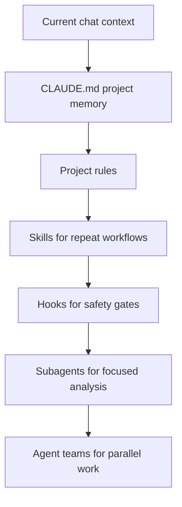
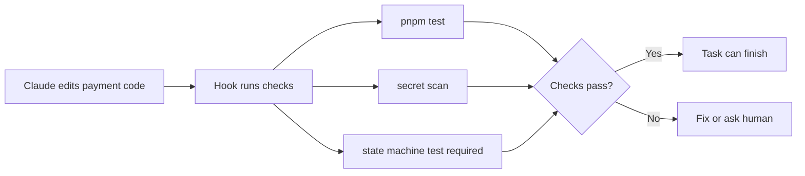
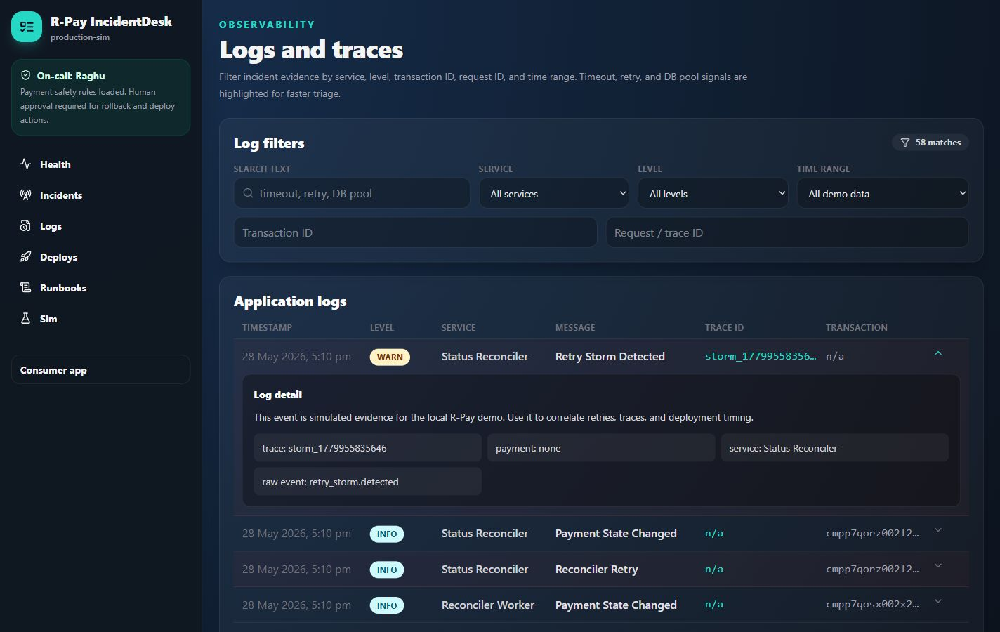
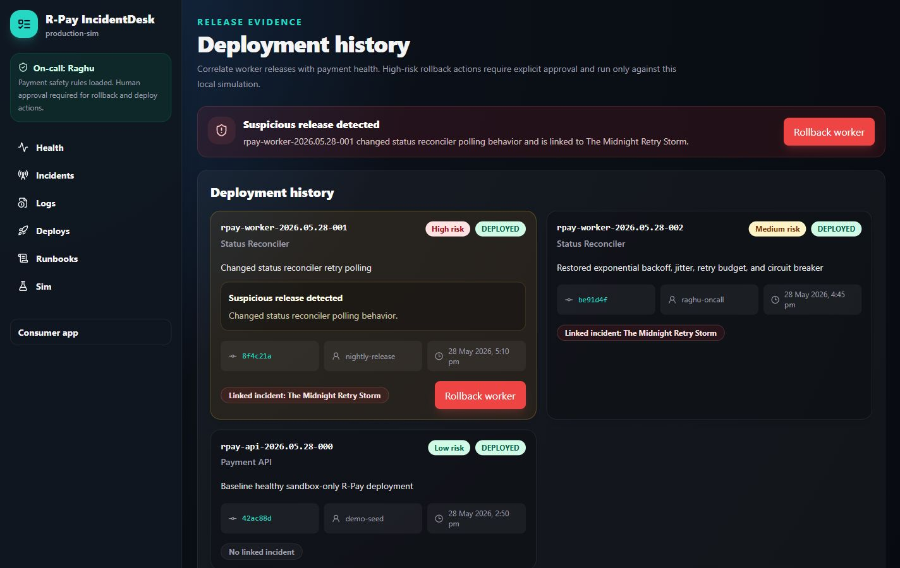
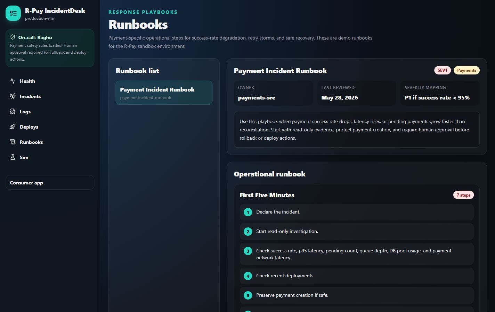

# Turning Claude into R-Pay's Incident Response Team

SEO-friendly title: Claude Code Incident Response Team: Memory, Skills, Hooks, Subagents, and Runbooks with R-Pay

Medium-friendly title: Turning Claude into R-Pay's Incident Response Team

Subtitle: The worst time to teach Claude your payment system is during an incident. So we prepare R-Pay before midnight.

Estimated reading time: 15 minutes

## Opening Hook

Imagine the pager goes off at 12:07 AM.

Payments are stuck. Success rate is falling. The database pool is red. A release went out thirty minutes ago, but nobody remembers exactly what changed.

Now imagine opening Claude Code and typing:

```text
Please investigate.
```

That is too late.

During an incident, you do not want to teach Claude what R-Pay is, which services exist, which actions are dangerous, how payment states work, or who must approve rollback.

You want Claude to already know.

Part 1 gave us a working R-Pay payment sandbox. Part 2 turns that codebase into an incident-ready system.

## Quick Recap: What Exists Now

R-Pay is a fictional UPI-style sandbox product.

It has:

- A consumer app
- An Express API
- PostgreSQL and Prisma
- A reconciler worker
- A UPI Switch Simulator
- Payment state machine
- Idempotency
- Audit logs
- Simulated metrics, logs, traces, deployments, incidents, runbooks, and RCA drafts

It does not move real money or call real payment APIs.

The ops surface is IncidentDesk.


Caption: IncidentDesk payment health dashboard: success rate, latency, queue depth, DB pool, and retry rate tell the incident story fast.

Why this image appears here: this is the shared truth board for humans and agent-assisted investigation.

## The Goal Is Not Autonomous Production Magic

The goal is safer engineering help.

Claude can:

- Read code
- Search logs
- Compare deployments
- Summarize traces
- Draft a hypothesis
- Suggest a rollback or hotfix
- Generate tests
- Draft RCA

Claude must not:

- Directly edit production payment records
- Mark pending payments successful
- Delete audit logs
- Deploy production-like changes without approval
- Pretend it is certain when evidence is incomplete

In this repo, the AI incident analysis and RCA panels are generated from local templates. They do not call a real Claude API. That is intentional for a local demo.

## The Memory Stack

Claude Code has a simple reality: each session needs context.

For R-Pay, context lives in layers.



Think of it like this:

| Need | Use |
| --- | --- |
| Remember project facts every session | `CLAUDE.md` |
| Repeat a workflow | Skill |
| Enforce a safety check | Hook |
| Investigate a focused area | Subagent |
| Compare multiple independent hypotheses | Agent team |
| Build custom agent automation | Agent SDK |
| Run a hosted long-running agent | Managed Agents |
| Take risky production-like action | Human approval |

Start simple. Add complexity only when it earns its keep.

## R-Pay `CLAUDE.md`

The repo already has `CLAUDE.md`.

It tells Claude:

- R-Pay is fictional and sandbox-only.
- Use the UPI Switch Simulator.
- No real payment APIs.
- Payment code is high-risk.
- Every payment needs an idempotency key.
- `SUCCESS` requires payment network confirmation.
- Audit logs must not be deleted.
- Production-like deployment or rollback needs human approval.
- Tests are required for state machine changes.

This is the kind of memory that should be boring.

Boring memory is good memory.

## Auto Memory Is Different

`CLAUDE.md` is memory you write on purpose.

Auto memory is memory Claude Code can write for itself based on repeated corrections and useful discoveries. It can remember things like "this repo uses pnpm" or "DB-heavy API tests need an explicit flag."

For R-Pay, I would keep high-risk payment rules in `CLAUDE.md`, not only in auto memory.

Auto memory is useful for discovered workflow friction. Safety rules should be explicit and reviewed.

### Copy-Paste Prompt: Create or Refresh `CLAUDE.md`

```text
Read the R-Pay repo and update CLAUDE.md.

Include only durable project rules:
- product purpose
- repo structure
- setup and verification commands
- safety boundary
- payment state machine rules
- idempotency rules
- audit log rules
- incident response rules
- approval requirements

Do not include long procedures.
Move procedures into skills instead.
```

## Rules vs Skills vs Hooks

Developers often mix these up.

Here is the practical version:

| Concept | What it is | R-Pay example |
| --- | --- | --- |
| Rule | Persistent instruction | Never mark `SUCCESS` without payment network confirmation |
| Skill | Reusable workflow | Investigate a payment incident |
| Hook | Automatic gate | Run tests before task completion |

If Claude needs to remember a fact, put it in `CLAUDE.md`.

If Claude needs to follow a multi-step workflow, make it a skill.

If something must run regardless of Claude's mood, make it a hook.

## Skills for R-Pay

The R-Pay repo does not currently include `.claude/skills` files, but these are the skills I would add before a real team used it heavily.

| Skill | Purpose |
| --- | --- |
| `investigate-payment-incident` | Gather metrics, logs, traces, deployments, and timeline evidence |
| `review-payment-state-machine` | Check transition safety and test coverage |
| `create-payment-api` | Add API behavior with idempotency, audit logs, and tests |
| `add-observability` | Add metrics, logs, traces, and dashboards |
| `generate-rca` | Draft structured RCA from timeline and evidence |
| `prepare-canary-deploy` | Build a deployment checklist with rollback plan |

### Copy-Paste Prompt: Create Incident Investigation Skill

```text
Create a Claude Code skill named investigate-payment-incident.

The skill should guide Claude to:
1. confirm R-Pay is sandbox-only
2. read CLAUDE.md
3. collect current metrics
4. inspect active incidents
5. inspect recent deployments
6. inspect logs and traces
7. form hypotheses with evidence
8. recommend mitigation options
9. call out uncertainty
10. require human approval for rollback or deploy actions

Do not allow direct payment record edits.
Do not mark PENDING payments as SUCCESS.
```

## Hooks as Safety Gates

Hooks are where you stop relying on memory alone.

R-Pay would benefit from hooks like:

- Run tests before task complete.
- Block production-like deploy without approval.
- Scan for secrets.
- Require tests when the payment state machine changes.
- Block commands that attempt to delete audit logs.



### Copy-Paste Prompt: Hook Design

```text
Design Claude Code hooks for R-Pay.

Required gates:
- run tests before task complete
- block production-like deploy without explicit approval
- scan for secrets before commit
- require state machine tests when packages/shared/src/state-machine.ts changes
- warn if audit log deletion appears in code

Return:
- hook name
- event
- command or script
- what it blocks
- failure message
```

Hooks should be boring, strict, and easy to understand.

## Subagents: Focused Investigators

Subagents are useful when the job has a clear role.

For R-Pay, I would create:

- `payment-architect`
- `backend-engineer`
- `frontend-engineer`
- `test-engineer`
- `security-reviewer`
- `reliability-engineer`
- `log-analyst`
- `trace-analyst`
- `incident-commander`
- `release-manager`
- `postmortem-writer`

Each subagent should have a narrow job and a safety boundary.

### Copy-Paste Prompt: Reliability Engineer Subagent

```text
Create a Claude Code subagent named reliability-engineer for R-Pay.

Role:
Investigate reliability risks in payment APIs, worker retry behavior, database pressure, queue depth, and incident recovery.

Must know:
- R-Pay is sandbox-only
- payment state changes are high-risk
- rollback and deploy actions need human approval
- do not edit payment records directly
- do not mark PENDING payments SUCCESS

Default output:
- findings
- evidence
- risk level
- recommended mitigation
- tests or alerts to add
```

### Copy-Paste Prompt: Log Analyst Subagent

```text
Create a Claude Code subagent named log-analyst for R-Pay.

Role:
Inspect logs for incident evidence.

Look for:
- retry storm patterns
- payment state changes
- UPI Switch Simulator latency
- DB pool saturation
- request IDs
- trace IDs
- transaction IDs

Return:
- timeline of relevant log events
- top patterns
- suspicious services
- evidence snippets
- what is still unknown
```

### Copy-Paste Prompt: Release Manager Subagent

```text
Create a Claude Code subagent named release-manager for R-Pay.

Role:
Correlate incidents with deployments and prepare safe rollback or canary plans.

Rules:
- no deployment-like action without human approval
- explain blast radius
- identify rollback target
- list verification checks
- include monitoring window

Return:
- candidate deployment
- risk assessment
- rollback vs hotfix recommendation
- approval checklist
- post-deploy verification plan
```

## Subagents vs Agent Teams

Subagents and agent teams both split work, but they solve different problems.

| Question | Subagent | Agent team |
| --- | --- | --- |
| How many Claude sessions? | One main session with focused helpers | Multiple independent Claude Code sessions |
| Communication | Subagent reports back to caller | Teammates can coordinate with each other |
| Best for | Focused investigation or review | Parallel exploration with multiple perspectives |
| Cost and overhead | Lower | Higher |
| R-Pay example | Ask log analyst to summarize timeout logs | Have reliability, release, and test teammates compare rollback vs hotfix |

Use subagents when you need focused workers.

Use agent teams when the problem benefits from disagreement.

Do not use agent teams for every task. If the next step is obvious, a single Claude Code session plus tests is usually better.

## Where Agent SDK and Managed Agents Fit

R-Pay does not currently call a real Claude API. Its AI incident analysis and RCA draft are generated from local templates and simulated evidence.

That is enough for this learning app.

If you wanted to turn this into a real internal engineering assistant, you would have two bigger options:

| Option | Use when | R-Pay example |
| --- | --- | --- |
| Agent SDK | You want to run a custom agent workflow in your own service or CI job | A scheduled incident-review agent that reads recent deployments and opens a PR with runbook updates |
| Managed Agents | You want hosted, long-running agent workflows with persistent environment and managed orchestration | A production-sim on-call assistant that watches incident tickets and prepares evidence summaries with approval gates |

The safety rule stays the same:

> More automation does not remove human approval for risky payment actions.

## IncidentDesk: The Product Surface for Operations

IncidentDesk is not just a dashboard. It is the place where humans and agents share evidence.

The current app includes:

- Health dashboard
- Incident list and detail pages
- Logs and traces
- Deployment history
- Runbook viewer
- Simulation controls
- AI incident analysis panel
- RCA draft panel

## Observability: Metrics Need a Story

R-Pay tracks:

- Success rate
- Failure rate
- Pending payments
- P95 latency
- Queue depth
- DB pool usage
- Payment network latency
- Retry rate
- Service health

These metrics matter because the Midnight Retry Storm is not visible from one number.

Success rate drops, but the cause is in retry behavior. Latency rises, but the bottleneck is database pressure caused by the worker. Pending payments climb, but the first bad change is a deployment.

Good observability lets you connect those facts.

## Logs and Traces



Caption: Logs and traces browser: the log analyst needs filters, patterns, trace IDs, transaction IDs, and expandable evidence.

Why this image appears here: logs become useful when they are searchable and connected to traces.

During an incident, a log analyst subagent should not just dump logs.

It should answer:

- What changed?
- Which service is noisy?
- Which requests are slow?
- Which trace IDs connect symptoms?
- Are failures user-facing or background-only?
- What evidence supports the current hypothesis?

Example incident logs:

```text
00:10:14Z WARN  status-reconciler Retry storm detected; retry_rate=16500/min queue_depth=98200
00:10:35Z ERROR payment-api DB pool saturated; pool_usage=100% p95_latency_ms=4800
00:11:02Z WARN  upi-switch-simulator Payment network latency above threshold; latency_ms=5100
```

## Deployment History



Caption: Deployment history: the suspicious worker release is visible next to the incident.

Why this image appears here: deployment correlation often turns symptoms into a root-cause hypothesis.

The suspicious release is:

`rpay-worker-2026.05.28-001`

Change summary:

> Changed status reconciler polling behavior.

Risk:

High.

Linked incident:

The Midnight Retry Storm.

That is exactly the kind of clue Claude should surface quickly.

## Runbooks



Caption: Runbook viewer: responders need practical steps before the incident starts, not after panic begins.

Why this image appears here: a runbook turns "go investigate" into a safer sequence.

The R-Pay payment incident runbook includes:

1. Confirm alert and scope.
2. Check success rate, latency, pending count, queue depth, DB pool usage, and payment network latency.
3. Check recent deployments.
4. Check status reconciler queue.
5. Decide rollback vs feature flag.
6. Get human approval.
7. Monitor recovery.
8. Generate RCA.

That is simple. Good.

Incident runbooks should be useful at 2 AM.

## AI Incident Analysis Panel

IncidentDesk includes an AI incident analysis panel.

In this local repo, the analysis is generated from templates and simulated evidence. It does not call a real Claude API.

The panel structure is still useful:

- Confidence
- Current hypothesis
- Evidence
- Recommended mitigation
- Human approval requirement

This maps nicely to how a real incident commander subagent should report.

## Common Mistake: Teaching Claude Only Through Chat

If you paste the same safety rule into every prompt, the project is telling you something.

That rule belongs in `CLAUDE.md`, a skill, or a hook.

Bad:

```text
Remember again that payment SUCCESS needs confirmation...
```

Better:

- Put the rule in `CLAUDE.md`.
- Add tests.
- Add a hook that detects payment state machine changes.
- Ask a subagent to review payment safety.

Chat is temporary. Repo memory is durable.

## What Claude Should Not Do During Incident Preparation

Safety box:

- Do not hide risky production actions behind automation.
- Do not remove human approvals.
- Do not allow production-like rollback without a clear approval step.
- Do not trust one metric alone.
- Do not create vague runbooks.
- Do not let skills or subagents bypass payment safety rules.
- Do not claim the local AI incident analysis is a real production Claude integration.

## R-Pay Walkthrough

An engineer can open:

- `http://localhost:3001/ops` for health
- `http://localhost:3001/ops/logs` for logs and traces
- `http://localhost:3001/ops/deployments` for release history
- `http://localhost:3001/ops/runbooks` for response steps
- `http://localhost:3001/ops/simulations` for safe local incident simulation

The most important thing is not that the dashboard looks good.

It is that the dashboard gives Claude and humans the same evidence:

- Metrics
- Logs
- Traces
- Deployments
- Timeline
- Runbook
- Approval actions
- RCA draft

## Checklist

- [ ] `CLAUDE.md` explains the product boundary and payment rules.
- [ ] Skills exist or are planned for repeat incident workflows.
- [ ] Hooks protect high-risk operations.
- [ ] Subagents have narrow roles and explicit safety rules.
- [ ] Agent teams are reserved for problems that need parallel perspectives.
- [ ] IncidentDesk shows metrics, logs, traces, deployments, and runbooks.
- [ ] Rollback and deployment-like actions require human approval.
- [ ] RCA drafting is based on evidence, not vibes.

## Ending Teaser

Now R-Pay is ready for a real test.

It has a payment flow, project memory, safety rules, runbooks, telemetry, deployment history, and an IncidentDesk dashboard.

In Part 3, it breaks at midnight.

The success rate drops from 99.2% to 91.4%. P95 latency jumps from 280 ms to 4.8 seconds. The database pool hits 100%. The status reconciler queue explodes.

And this time, Claude is not meeting the system for the first time.

## Suggested Medium Tags

- Claude Code
- SRE
- Incident Response
- AI Agents
- Observability

## Suggested Hero Image Prompt

Create a serious dark-mode incident command center illustration for a fictional fintech product called R-Pay. Show engineers watching payment health metrics, logs, traces, deployment history, and a runbook panel. Include subtle AI assistant presence as analysis cards, not a robot. No real incident management product branding, no PagerDuty, Datadog, Grafana, Sentry, bank, NPCI, PhonePe, Google Pay, Paytm, or BHIM logos.

## Social Media Snippets

1. The worst time to teach Claude your system is during an incident. Part 2 of the R-Pay series shows how `CLAUDE.md`, skills, hooks, subagents, runbooks, and IncidentDesk prepare the ground before midnight.

2. My rule of thumb: `CLAUDE.md` remembers facts, skills repeat workflows, hooks enforce gates, subagents investigate focused areas, and agent teams compare independent hypotheses.

3. R-Pay's IncidentDesk is a local sandbox, but the operational shape is real: success rate, p95 latency, queue depth, DB pool usage, logs, traces, deployments, runbooks, approval gates, and RCA drafts.
