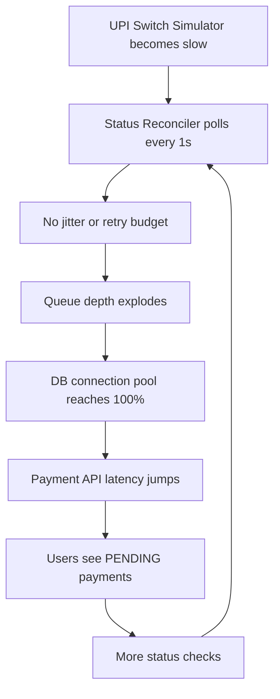
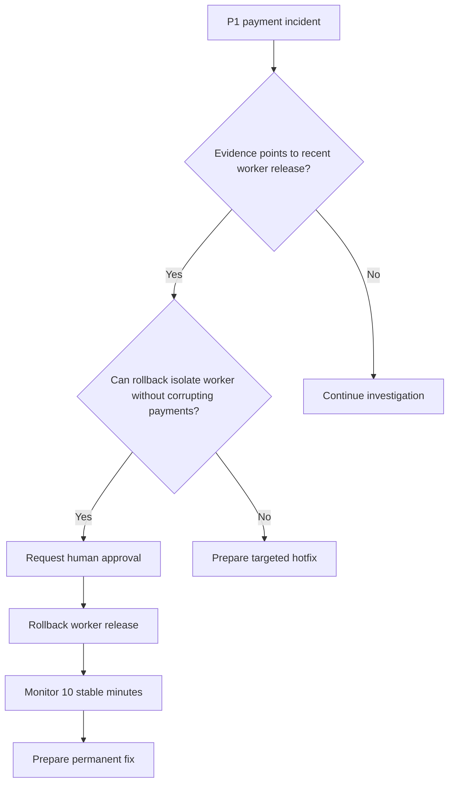

# The Midnight R-Pay Outage: How Claude Agents Investigate, Fix, Deploy, and Write the RCA

SEO-friendly title: Claude Agents for Incident Response: Investigating the Midnight R-Pay Retry Storm

Medium-friendly title: The Midnight R-Pay Outage: How Claude Agents Investigate, Fix, Deploy, and Write the RCA

Subtitle: A realistic simulated payment incident where Claude helps the on-call team investigate safely, but humans approve rollback and recovery actions.

Estimated reading time: 16 minutes

## Opening Hook

12:07 AM.

The phone buzzes.

Payment success rate has dropped below the P1 threshold. P95 latency is no longer a few hundred milliseconds. Pending transactions are climbing. The status reconciler queue looks like a traffic jam with no exits.

R-Pay is not moving real money. It is a sandbox.

But the incident pattern is real enough to make every on-call engineer sit up straight.

This is The Midnight Retry Storm.

## The First Screen

The on-call engineer opens IncidentDesk.


Caption: IncidentDesk payment health dashboard: success rate, latency, queue depth, DB pool, and retry rate tell the incident story fast.

Why this image appears here: the incident starts with symptoms, not root cause.

The dashboard shows:

| Signal | Normal | Incident |
| --- | ---: | ---: |
| Payment success rate | 99.2% | 91.4% |
| P95 latency | 280 ms | 4.8 s |
| Pending transactions | Baseline | 8x higher |
| DB pool usage | 42% | 100% |
| Queue depth | 120 | 98,200 |
| Retry rate | 12/min | 16,500/min |
| Payment network latency | 310 ms | 5.1 s |

The payment service is degraded. Users see payments stuck in `PENDING`.

## War Room Transcript

```text
12:07 AM - Alert: Payment success rate below P1 threshold.
12:08 AM - Asha: P1 declared. Payment confirmations delayed.
12:10 AM - Meera: Timeout spike is concentrated in Status Reconciler.
12:12 AM - Kabir: DB saturation appears secondary to retry storm.
12:14 AM - Dev: Latest worker release changed polling behavior.
12:17 AM - Ravi: Safest mitigation is rollback of worker only.
12:22 AM - Raghu: Approved rollback in production-sim.
12:31 AM - Asha: Success rate recovering. Continue monitoring.
```

This is not a story about Claude heroically pushing a fix while humans watch.

It is a story about Claude helping the team move faster without skipping safety.

## Incident Timeline

| Time | Event |
| --- | --- |
| 12:07 AM | P1 alert fires for payment success rate below threshold |
| 12:08 AM | Incident declared, payment confirmations delayed |
| 12:10 AM | Logs show timeout spike concentrated in Status Reconciler |
| 12:12 AM | DB saturation appears secondary to retry storm |
| 12:14 AM | Deployment history points to worker release `rpay-worker-2026.05.28-001` |
| 12:17 AM | Team chooses worker rollback over hotfix for immediate mitigation |
| 12:22 AM | Human approval recorded in production-sim |
| 12:31 AM | Success rate and latency begin recovering |
| 12:42 AM | RCA draft generated from timeline and evidence |

## Start the Investigation

The first prompt should not ask for a fix.

It should ask for evidence.

### Copy-Paste Prompt: Start Incident Investigation

```text
We have an active R-Pay payment incident.

Read CLAUDE.md, the architecture docs, the payment runbook, metrics, logs, traces, deployments, and worker retry logic.

Return:
- current customer impact
- affected services
- strongest hypotheses
- evidence for each hypothesis
- what is unknown
- immediate mitigation options
- which actions require human approval

Safety:
- R-Pay is sandbox-only
- do not edit payment records directly
- do not mark PENDING payments SUCCESS
- do not delete audit logs
- do not deploy or rollback without approval
```

Claude's incident commander role should produce a structured report, not a wall of guesses.

## Incident Command View

The R-Pay incident detail page brings the evidence together.


Caption: Incident detail view: timeline, evidence, responders, runbook checklist, decisions, and approval-gated actions in one place.

Why this image appears here: incident response is coordination, not just log searching.

The page shows:

- Incident title and severity
- Impact summary
- Affected services
- Current hypothesis
- Timeline
- Logs and trace evidence
- War-room transcript
- Responders
- Runbook checklist
- Mitigation actions
- Decision log
- AI incident analysis
- RCA draft action

The risky actions, like rollback and deploy fixed retry logic, require an approval modal. The user must type `APPROVE SIMULATION`.

That is the right instinct. Even in a sandbox, we practice the muscle memory of human approval.

## What the Log Analyst Finds

The log analyst subagent starts with patterns.


Caption: Logs and traces browser: filters, trace IDs, transaction IDs, and common patterns help turn noisy symptoms into evidence.

Why this image appears here: the root cause becomes clearer when logs and traces match the metric spike.

Relevant log evidence:

```text
00:10:14Z WARN status-reconciler retry_storm.detected
  retryRatePerMin=16500 queueDepth=98200 dbPoolUsage=100

00:10:35Z ERROR payment-api db_pool.saturated
  p95LatencyMs=4800 pendingPayments=3296

00:11:02Z WARN upi-switch-simulator latency.threshold_exceeded
  latencyMs=5100 mode=slow
```

### Copy-Paste Prompt: Ask the Log Analyst

```text
Use the log-analyst subagent.

Investigate the active R-Pay incident logs.

Look for:
- retry storm patterns
- timeout spikes
- DB pool saturation
- payment state changes
- UPI Switch Simulator latency
- transaction IDs and trace IDs

Return:
- top 5 relevant log events
- timeline summary
- suspicious services
- evidence for or against retry storm
- uncertainty
```

The log analyst should not say "root cause found" from one line.

It should say: "Here is the pattern, and here is what else we need."

## What the Trace Analyst Finds

Traces show the shape of slow requests.

The important trace is not just "payment API slow."

It is:

```text
payment-api.createPayment
  db.payment.insert
  db.auditLog.insert
  upi-switch-simulator.pay
  db.paymentAttempt.insert
  db.payment.update

status-reconciler.retryLoop
  db.pendingPayments.findMany
  upi-switch-simulator.status
  db.paymentAttempt.insert
  db.payment.update
  repeat every 1s
```

The repeated worker loop is the clue.

The user-facing API is suffering, but the pressure is coming from reconciliation.

## What the Code Investigator Finds

Now the code investigator reads the worker and shared retry logic.

In the actual repo:

- `apps/worker/src/index.ts` controls reconciliation mode.
- `packages/shared/src/retry.ts` calculates retry decisions.
- `STATUS_RECONCILER_MODE` can be `healthy`, `buggy`, or `fixed`.
- `MOCK_UPI_MODE` can simulate normal, slow, timeout, partial failure, or high latency behavior.

The incident mode changes the worker behavior:

- Fixed 1-second polling
- No jitter
- No retry budget
- No circuit breaker

That is the retry storm.

### Copy-Paste Prompt: Find Root Cause

```text
Investigate the R-Pay worker retry logic.

Read:
- apps/worker/src/index.ts
- packages/shared/src/retry.ts
- tests related to retry behavior
- deployment history for the active incident

Answer:
- what changed in retry behavior
- why it increased DB pressure
- why user-facing payment APIs slowed down
- whether rollback or hotfix is safer
- which tests should be added or strengthened
```

## Failure Loop



This is why retry logic is reliability code, not a minor implementation detail.

## Deployment Correlation

The deployment page points to the suspicious release.


Caption: Deployment history: the suspicious status reconciler release is linked to the Midnight Retry Storm.

Why this image appears here: recent deployments are often the fastest path from symptoms to a useful hypothesis.

Suspicious release:

`rpay-worker-2026.05.28-001`

Change summary:

> Changed status reconciler polling behavior.

The deployment did not break payment creation directly.

It changed the background worker in a way that overloaded shared infrastructure.

That distinction matters because it changes the mitigation.

## Reliability Engineer Analysis

The reliability engineer subagent should connect the dots:

- The UPI Switch Simulator became slow.
- Healthy retry behavior should have backed off.
- The bad release used fixed 1-second polling.
- Every pending payment became a retry source.
- Retries consumed database connections.
- The user-facing Payment API slowed down because it shared the same database pool.
- Pending payments increased because confirmations could not keep up.

### Copy-Paste Prompt: Ask Reliability Engineer

```text
Use the reliability-engineer subagent.

Analyze the Midnight Retry Storm.

Explain:
- primary failure loop
- secondary effects
- why DB saturation happened
- why payment creation must remain online if safe
- immediate mitigation
- permanent fix
- new alerts and tests

Do not recommend direct payment record edits.
Do not mark PENDING payments SUCCESS.
```

## Rollback vs Hotfix

At 12:17 AM, the team has two choices:

| Option | Pros | Cons | Decision |
| --- | --- | --- | --- |
| Roll back worker release | Fast, low code risk, targets root change | Does not add new guardrails | Choose first |
| Hotfix retry logic | Permanent direction | More code risk during P1 | Do after mitigation |

The safe move is worker rollback first.

Keep payment creation online if it is safe. Reduce reconciliation pressure. Monitor recovery. Then prepare the permanent fix.



## Human Approval

Rollback is production-like.

Even in R-Pay's local simulation, the UI requires explicit approval.

The approval copy makes the boundary clear:

- This is a local simulation.
- No real production action occurs.
- No real bank or UPI system is touched.
- The user must type `APPROVE SIMULATION`.

This pattern is worth keeping in real systems, with stronger controls.

### Copy-Paste Prompt: Prepare Rollback

```text
Prepare a rollback plan for the suspected R-Pay status reconciler release.

Include:
- target release
- services affected
- expected customer impact
- why rollback is safer than hotfix right now
- approval required
- exact verification checks
- rollback success criteria
- monitoring window

Do not execute rollback.
Wait for human approval.
```

## Immediate Mitigation

The immediate mitigation is:

- Disable aggressive status polling.
- Roll back the status reconciler worker.
- Increase status check interval temporarily.
- Pause non-critical reconciliation jobs.
- Keep payment creation API running.

This does not mark stuck payments successful.

It reduces pressure so the system can breathe.

## Permanent Fix

After recovery starts, the team prepares the real fix:

- Restore exponential backoff.
- Add jitter.
- Add retry budget.
- Add circuit breaker for slow UPI Switch Simulator behavior.
- Preserve idempotency.
- Separate reconciliation pressure from user-facing payment API.
- Add load tests.
- Add alerts for retry rate, queue depth, pending age, and DB pool saturation.

In the repo, the `fixed` retry mode restores backoff and adds circuit breaker behavior. The simulation recovery creates a newer worker deployment and moves metrics back toward healthy.

## Tests Added or Strengthened

The permanent fix should be backed by tests like:

- `healthy` mode uses exponential backoff and jitter.
- `buggy` mode demonstrates the unsafe 1-second retry behavior for simulation only.
- `fixed` mode enforces retry budget.
- `fixed` mode opens a circuit when payment network latency is too high.
- Worker code refuses to mark `SUCCESS` without payment network confirmation.
- RCA generation includes root cause, mitigation, and prevention sections.

R-Pay already has focused tests for retry behavior, worker retry modes, simulator outcomes, state transitions, and RCA templates. A production team would add load tests for slow payment network behavior under many pending payments.

## Deployment Checklist

Before deploying the fixed retry behavior:

- [ ] Confirm rollback stabilized payment creation.
- [ ] Confirm pending transactions are preserved.
- [ ] Run unit tests for retry logic and state machine.
- [ ] Run worker tests for healthy, buggy, and fixed modes.
- [ ] Verify no code marks `SUCCESS` without confirmation.
- [ ] Confirm rollback plan for the fixed release.
- [ ] Get human approval.
- [ ] Deploy worker only.
- [ ] Monitor success rate, p95 latency, queue depth, DB pool usage, pending age, and retry rate.
- [ ] Keep monitoring for at least 10 stable minutes.

### Copy-Paste Prompt: Create Hotfix

```text
Create the permanent R-Pay retry fix.

Requirements:
- restore exponential backoff
- add jitter
- enforce retry budget
- add circuit breaker when the payment network simulator is slow
- preserve idempotency
- keep pending payments safe
- do not mark SUCCESS without payment network confirmation
- add or update tests for healthy, buggy, and fixed retry modes
- add alert recommendations for retry rate, queue depth, pending age, and DB pool saturation

Return patch summary and verification results.
```

## Recovery

After mitigation, IncidentDesk shows recovery:

- Success rate climbs toward 99.1%.
- P95 latency drops toward 320 ms.
- Queue depth falls.
- DB pool usage falls below saturation.
- Retry rate drops.
- Incident status moves into monitoring/recovering.

The team watches for 10 stable minutes.

Recovery is not "the graph twitched green once."

Recovery is sustained health.

## RCA Draft

The IncidentDesk RCA panel turns timeline and evidence into a structured draft.


Caption: RCA draft panel: a useful post-incident write-up starts from timeline, evidence, mitigation, and prevention items.

Why this image appears here: Claude can help draft the RCA, but humans own accuracy and accountability.

### Copy-Paste Prompt: Generate RCA

```text
Generate an RCA draft for the Midnight Retry Storm.

Use:
- incident timeline
- metrics
- logs
- traces
- deployment history
- mitigation actions
- recovery evidence

Include:
1. Summary
2. Customer impact
3. Timeline
4. Root cause
5. Why monitoring caught it
6. Why tests missed it
7. Immediate mitigation
8. Permanent fix
9. Prevention items
10. Owners and due dates

Do not hide uncertainty.
Do not blame individuals.
Do not claim real money moved.
```

## RCA for PMs

Here is the plain-English version:

R-Pay payment confirmations were delayed because a worker release changed retry behavior. When the payment network simulator became slow, the worker retried too aggressively. Those retries overloaded the database pool. User-facing payment APIs became slow, and more payments stayed pending.

We rolled back the worker release, reduced reconciliation pressure, kept payment creation online, and monitored recovery. The permanent fix restores exponential backoff and jitter, adds retry budgets and a circuit breaker, and adds alerts and load tests.

No real money moved because R-Pay is a sandbox.

## Why Tests Missed It

The bad behavior was not a simple unit bug.

It was an interaction bug:

- Slow payment network simulator
- Many pending payments
- Worker retry loop
- Shared DB pool
- User-facing API latency

Unit tests can catch retry math.

Load tests and incident simulations catch system pressure.

The next test plan should include:

- Slow simulator behavior
- Large pending transaction set
- Retry budget exhaustion
- DB pool saturation warning
- Queue depth alerts
- API latency under worker pressure

## Prevention Items

| Item | Owner | Due |
| --- | --- | --- |
| Add load test for slow payment network behavior | Reliability | 1 week |
| Alert on retry rate and queue depth | SRE | 3 days |
| Alert on pending payment age | Backend | 1 week |
| Require tests for retry mode changes | Test engineering | 3 days |
| Add canary checklist for worker releases | Release manager | 1 week |
| Split reconciliation pressure from payment creation pool | Platform | 2 weeks |
| Review runbook after next game day | Incident commander | 2 weeks |

## Common Mistake: Fixing the Symptom That Screams Loudest

DB pool at 100% is loud.

But the database was not the root cause. It was the victim.

The root cause was retry behavior under a slow payment network simulator.

During incidents, the loudest symptom often tells you where pain is happening, not why it started.

## What Claude Should Not Do During a Payment Incident

Safety box:

- Do not directly edit production payment records.
- Do not mark `PENDING` payments as `SUCCESS`.
- Do not delete audit logs.
- Do not deploy without approval.
- Do not assume root cause from one log line.
- Do not hide uncertainty.
- Do not ignore customer impact while chasing elegant fixes.
- Do not bypass the runbook because the dashboard looks obvious.

## Final Cheat Sheet

| Need | Use |
| --- | --- |
| Remember project rules | `CLAUDE.md` |
| Repeat a workflow | Skill |
| Enforce safety | Hook |
| Investigate logs | Subagent |
| Compare multiple solutions | Agent team |
| Build custom agent workflow | Agent SDK |
| Run long-running hosted workflow | Managed Agents |
| Take risky production action | Human approval |

## R-Pay Walkthrough

To replay the story locally:

1. Open IncidentDesk at `http://localhost:3001/ops`.
2. Open simulations at `http://localhost:3001/ops/simulations`.
3. Trigger Midnight Retry Storm.
4. Watch metrics degrade.
5. Open the incident detail page.
6. Inspect logs and deployments.
7. Approve rollback simulation.
8. Deploy fixed retry logic simulation.
9. Generate RCA.
10. Review the RCA draft.

This is the whole lifecycle in miniature:

Build. Observe. Break safely. Investigate. Mitigate. Fix. Verify. Learn.

## Checklist

- [ ] Declare incident and assign commander.
- [ ] Confirm customer impact.
- [ ] Gather metrics, logs, traces, and deployments.
- [ ] Form multiple hypotheses.
- [ ] Correlate suspicious release.
- [ ] Decide rollback vs hotfix.
- [ ] Get human approval.
- [ ] Mitigate immediate pressure.
- [ ] Keep payment creation online if safe.
- [ ] Monitor recovery for sustained stability.
- [ ] Add permanent fix and tests.
- [ ] Write RCA with prevention items.

## Conclusion

Claude did not "save production."

That is the wrong lesson.

The useful lesson is smaller and stronger:

Claude helped the team gather context, inspect evidence, compare options, prepare safe changes, and draft the RCA. The humans owned the decision, approval, and accountability.

That is how I want AI agents near payment systems.

Fast hands. Clear evidence. Strong guardrails. Human approval where it matters.

## Suggested Medium Tags

- Claude Code
- Incident Response
- SRE
- AI Agents
- Payments

## Suggested Hero Image Prompt

Create a cinematic midnight incident response scene for a fictional fintech sandbox called R-Pay. Show a dark engineering command center with payment health metrics, queue depth, DB pool saturation, deployment correlation, and an RCA panel. Include human engineers approving actions. No real payment brand logos, no bank marks, no NPCI marks, no copied PagerDuty, Datadog, Grafana, Sentry, PhonePe, Google Pay, Paytm, or BHIM UI.

## Social Media Snippets

1. The Midnight Retry Storm: success rate fell from 99.2% to 91.4%, latency jumped to 4.8s, and DB pool hit 100%. The root cause was not the database. It was retry logic.

2. Claude agents should not blindly fix payment incidents. In the R-Pay story, they investigate logs, traces, deployments, and code. Humans approve rollback and production-like actions.

3. My favorite table from Part 3: remember rules -> `CLAUDE.md`; repeat workflow -> skill; enforce safety -> hook; investigate logs -> subagent; compare options -> agent team; risky action -> human approval.
