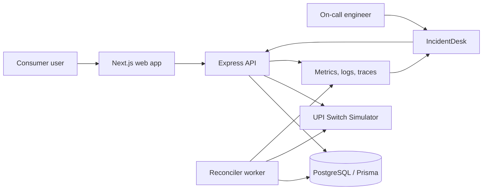

# Claude Agents in Action: Building and Rescuing R-Pay, a UPI-Style Payment System

## Series Positioning

This series teaches Claude Code and production incident workflows through one running example: R-Pay, also called Raghu's Pay.

R-Pay is a fictional UPI-style payment sandbox for India. It has a consumer payment app and an internal IncidentDesk dashboard. It does not connect to real UPI rails, banks, NPCI systems, PSP APIs, payment gateways, or real money movement.

The angle is practical:

> We use Claude Code as an engineering partner across the software lifecycle: product discovery, architecture, implementation, tests, observability, incident response, recovery, and RCA.

This is not an AI hype series. Claude helps, but humans remain responsible for payment safety and production-like decisions.

## Reader Persona

The reader is a software developer who can build APIs and frontend apps but is new to:

- Claude Code as an agentic coding assistant
- Project memory with `CLAUDE.md`
- Skills and hooks
- Subagents and agent teams
- Agent SDK and Managed Agents
- Production incident workflows
- Observability and RCA writing

They want to know what these concepts look like in a real engineering workflow, not as abstract definitions.

## Story Arc

Part 1 starts during a calm build week. We build R-Pay by asking Claude to interview us, write useful architecture docs, design a payment state machine, implement a small vertical slice, and verify it.

Part 2 moves from feature delivery to operational readiness. We add project memory, safety rules, skills, hooks, subagents, runbooks, metrics, logs, traces, deployment history, and an IncidentDesk dashboard.

Part 3 opens at midnight. The Midnight Retry Storm hits. Payment success rate drops, latency spikes, pending transactions climb, DB connections saturate, and the status reconciler queue explodes. Claude agents help investigate, but humans approve rollback and production-like actions.

## What Has Already Been Built

The current R-Pay repo contains:

- A TypeScript monorepo
- Next.js consumer app
- Next.js IncidentDesk dashboard
- Express API
- PostgreSQL and Prisma data model
- Worker service for reconciliation
- UPI Switch Simulator
- Payment state machine in `packages/shared`
- Idempotency handling
- Audit logs for payment creation and state changes
- Simulated metrics, logs, traces, incidents, deployments, runbooks, and RCA drafts
- Local Docker setup
- Vitest tests for state machine, retry behavior, simulator behavior, RCA generation, worker retry modes, and API behavior when DB tests are enabled

Implementation note:

The repo does not currently contain committed `TEST_PLAN.md` or `TASKS.md` files. The articles can still show prompts that ask Claude to generate those artifacts, but they should not claim they already exist in the codebase.

## R-Pay Product Summary

R-Pay is a sandbox payment product with two surfaces:

| Surface | Audience | Purpose |
| --- | --- | --- |
| R-Pay Consumer App | End users | Send sandbox payments, scan a QR simulation, view status and transaction history |
| R-Pay IncidentDesk | Engineers | Monitor health, simulate incidents, inspect evidence, follow runbooks, recover, and generate RCA drafts |

## R-Pay User-Facing Features

- Home dashboard with greeting, balance card, masked bank account, and UPI ID
- Quick actions for Scan & Pay, Pay UPI ID, Pay Contact, and History
- Payment form with UPI ID flow, amount chips, note field, and selected bank account
- QR scan simulation with merchant preview
- Payment status screen for success, pending, failed, timed out, and reconciled states
- Transaction history with search and filters
- Transaction receipt/detail view with reference ID, idempotency key, attempts, and audit timeline
- Support page for reporting payment issues

## R-Pay IncidentDesk Features

- Payment health dashboard at `/ops`
- Success rate, failure rate, pending payments, p95 latency, queue depth, DB pool usage, payment network latency, and retry rate
- Service health panel for Payment API, Status Reconciler, UPI Switch Simulator, PostgreSQL, and Redis
- Active incident banner and incident detail view
- Logs and trace browser
- Deployment history with suspicious release highlighting
- Runbook viewer
- Simulation controls for normal traffic, Midnight Retry Storm, recovery, fixed retry logic, and RCA generation
- Approval modal for rollback and deployment-like actions
- AI incident analysis and RCA draft panels generated from local templates

## Architecture Overview

Key repo locations:

| Area | Location |
| --- | --- |
| Consumer and ops UI | `apps/web` |
| API routes and services | `apps/api` |
| Reconciler worker | `apps/worker` |
| Shared state machine, retry logic, schemas | `packages/shared` |
| Database schema and seed data | `prisma` |
| Simulation scripts | `scripts` |
| Architecture docs | `docs/architecture` |
| Incident runbook | `docs/runbooks/payment-incident-runbook.md` |

## Glossary

| Term | Meaning in this series |
| --- | --- |
| Claude Code | Agentic coding assistant that can inspect files, edit code, run commands, and verify results with developer oversight |
| Workflow | A predictable sequence of steps, such as run tests after editing payment code |
| Agent | A system that can gather context, choose actions, use tools, and iterate toward a goal |
| `CLAUDE.md` | Project memory file that tells Claude how the repo works and what rules matter |
| Auto memory | Claude Code notes that can persist learnings across sessions on a local machine |
| Skill | A reusable task-specific instruction bundle, often backed by a `SKILL.md` file |
| Hook | A configured action that runs at lifecycle events, such as before a production-like deploy |
| Subagent | A focused helper agent with its own context and role |
| Agent team | Multiple Claude Code sessions working together with a lead and teammates |
| Agent SDK | A way to build custom agent workflows using the Claude agent harness in your own process |
| Managed Agents | Anthropic-hosted agent infrastructure for long-running or production agent workflows |
| UPI Switch Simulator | Local sandbox service that stands in for an external payment network |
| RCA | Root Cause Analysis written after an incident |

## Safety Boundaries

- R-Pay is fictional.
- R-Pay is a sandbox product.
- It does not use real UPI APIs, bank APIs, NPCI credentials, PSP APIs, or payment gateway APIs.
- No real money moves.
- User-facing flows are inspired by common Indian UPI payment app patterns, but the UI is original.
- Any production-like rollback, deployment, or payment-state correction requires human approval.
- Claude must not directly edit production payment records.
- Do not mark a payment `SUCCESS` without valid payment network confirmation.
- Do not delete audit logs.
- Payment code is high-risk and requires tests.

## Article-by-Article Outline

### Part 1: Building R-Pay

Title: Building R-Pay: A UPI-Style Payment App with Claude Code Agents

Purpose:

Teach Claude Code basics through product discovery, design docs, state machine design, API design, implementation, and verification.

Core beats:

1. Open with the danger of saying "just build me a payment app."
2. Define what R-Pay is and is not.
3. Use Claude Code to interview the product owner.
4. Generate useful architecture docs.
5. Design the payment state machine.
6. Build the first vertical slice.
7. Explain idempotency, attempts, and audit logs.
8. Show the consumer app screenshots.
9. End with production readiness as the next problem.

Screenshots:

- `../../screenshots/rpay-home-final.png`
- `../../screenshots/rpay-pay-final.png`
- `../../screenshots/rpay-status-final.png`
- `../../screenshots/rpay-transactions-final.png`

### Part 2: Turning Claude into R-Pay's Incident Response Team

Title: Turning Claude into R-Pay's Incident Response Team

Purpose:

Teach memory, rules, skills, hooks, subagents, agent teams, observability, runbooks, and IncidentDesk.

Core beats:

1. Open with: the worst time to teach Claude your system is during an incident.
2. Show what belongs in `CLAUDE.md`.
3. Explain rules vs skills vs hooks.
4. Design useful incident skills.
5. Design subagents for payment, logs, traces, reliability, security, release, and postmortem work.
6. Explain when an agent team is worth the overhead.
7. Walk through IncidentDesk: health, logs, deployments, runbooks.
8. End by preparing for the Midnight Retry Storm.

Screenshots:

- `../../screenshots/ops-health-final.png`
- `../../screenshots/ops-logs-final.png`
- `../../screenshots/ops-deployments-final.png`
- `../../screenshots/ops-runbooks-final.png`

### Part 3: The Midnight R-Pay Outage

Title: The Midnight R-Pay Outage: How Claude Agents Investigate, Fix, Deploy, and Write the RCA

Purpose:

Tell a realistic simulated production incident story and teach safe agent-assisted response.

Core beats:

1. Open at 12:07 AM with a P1 alert.
2. Show symptoms: success rate 99.2% to 91.4%, latency 280 ms to 4.8 s, pending 8x, DB pool 100%, queue explosion.
3. Use IncidentDesk evidence.
4. Show fake Slack war-room transcript.
5. Let incident commander, log analyst, trace analyst, code investigator, and reliability engineer subagents investigate.
6. Correlate the bad worker release.
7. Decide rollback vs hotfix.
8. Require human approval.
9. Recover, monitor, and generate RCA.
10. End with a cheat sheet for choosing `CLAUDE.md`, skills, hooks, subagents, teams, Agent SDK, Managed Agents, and human approvals.

Screenshots:

- `../../screenshots/ops-health-final.png`
- `../../screenshots/ops-incident-detail-final.png`
- `../../screenshots/ops-logs-final.png`
- `../../screenshots/ops-deployments-final.png`
- `../../screenshots/ops-rca-final.png`

## Continuity Rules

- Always call R-Pay fictional and sandbox-based.
- Do not imply it is a real UPI or banking product.
- Use "UPI Switch Simulator" or "payment network simulator" in reader-facing explanations.
- Use "mock" sparingly, only for internal implementation or safety boundary explanation.
- Keep payment safety rules consistent across all parts.
- Do not claim Claude directly changed production records.
- Do not claim Agent SDK or Managed Agents are implemented in R-Pay. They are taught as extension paths.
- Mention that AI incident analysis and RCA drafts in this repo are generated from local templates, not by calling a real Claude API.
- Keep the same incident name: The Midnight Retry Storm.
- Keep the same root cause: fixed 1-second polling replaced exponential backoff and jitter.

## Screenshot Plan

The screenshots should appear as proof that the app exists and as teaching anchors.

| Screenshot | Main use |
| --- | --- |
| R-Pay home | Show the consumer product is real enough to reason about |
| R-Pay pay | Show the payment vertical slice |
| R-Pay status | Teach payment status and references |
| R-Pay transactions | Teach history, filtering, and receipts |
| Ops health | Teach observability and incident signals |
| Ops incident detail | Teach incident command view |
| Ops logs | Teach evidence gathering |
| Ops deployments | Teach deployment correlation |
| Ops runbooks | Teach repeatable incident workflow |
| Ops RCA | Teach post-incident learning |

## Diagram List

Part 1:

- R-Pay high-level architecture
- Payment state machine
- Claude Code build workflow
- Consumer payment flow

Part 2:

- Claude memory and extension hierarchy
- IncidentDesk observability pipeline
- Subagents around R-Pay
- Hooks as safety gates

Part 3:

- Retry storm failure loop
- Incident investigation flow
- Rollback vs hotfix decision tree
- Recovery and RCA workflow

## Image Plan

Use generated or illustrated hero images, not copied product screenshots from real payment apps.

Style:

- Original R-Pay visual identity
- Serious fintech tone
- No real UPI/bank/NPCI/PhonePe/Google Pay/Paytm/BHIM logos
- No real customer data
- No real payment credentials

Each article should also use actual screenshots from the local app.

## Promotion Plan

Use three promotion channels:

- LinkedIn: architecture and incident learning angle
- X/Twitter: punchy thread with screenshots and diagrams
- Medium subtitle/canonical preview: story hook and safety boundary

The promotion copy should emphasize practical engineering:

- Build a payment sandbox with Claude Code
- Teach Claude project rules before incidents
- Use agents for investigation, not blind production action
- Keep humans in the loop for risky payment operations

## Reference Plan

Use primary or official sources:

- Anthropic Engineering for workflow vs agent framing
- Claude Code docs for memory, skills, hooks, subagents, and agent teams
- Claude Agent SDK docs for custom agent workflows
- Claude Managed Agents docs/blog for hosted agent infrastructure
- AWS Well-Architected and Incident Manager docs for runbooks, incident response, and observability
- NPCI official UPI overview for high-level UPI context only

Avoid unsupported statistics. If a number is not from the R-Pay simulation, verify it before using it.
